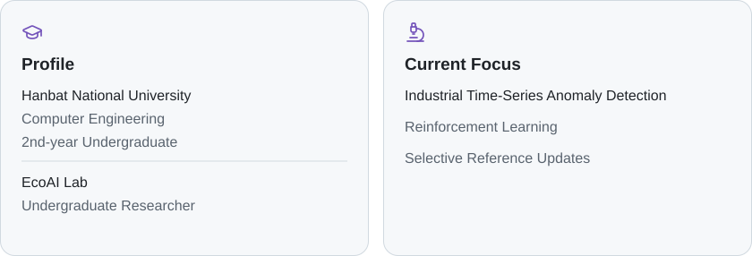
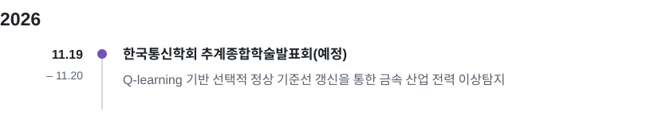
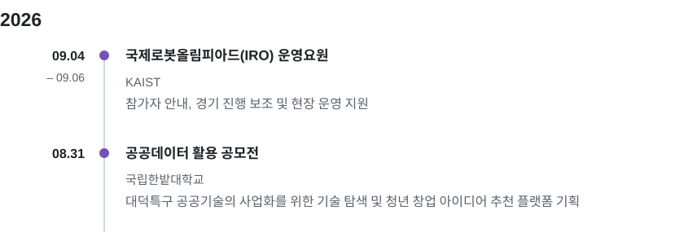

<!-- Generated from profile.json by tools/build.py. Upload README.md AND assets/. -->

  <picture>
    <source media="(max-width: 767px)" srcset="assets/header-mobile.svg">
    
  </picture>

## About Me 👋

My goal is to bridge <strong>AI research and real-world applications</strong> through data-driven problem solving.

<picture>
  <source media="(prefers-color-scheme: dark) and (max-width: 767px)" srcset="assets/about-dark-mobile.svg">
  <source media="(max-width: 767px)" srcset="assets/about-light-mobile.svg">
  <source media="(prefers-color-scheme: dark)" srcset="assets/about-dark-desktop.svg">
  
</picture>

**Research Interests**

  
  
  
  

## Tech Stack

<strong>Languages</strong>

  
  
  

<strong>AI &amp; Data Science</strong>

  
  
  
  

## Research Timeline

<picture>
  <source media="(prefers-color-scheme: dark) and (max-width: 767px)" srcset="assets/research-dark-mobile.svg">
  <source media="(max-width: 767px)" srcset="assets/research-light-mobile.svg">
  <source media="(prefers-color-scheme: dark)" srcset="assets/research-dark-desktop.svg">
  
</picture>

## On- & Off-Campus Activities

<picture>
  <source media="(prefers-color-scheme: dark) and (max-width: 767px)" srcset="assets/activities-dark-mobile.svg">
  <source media="(max-width: 767px)" srcset="assets/activities-light-mobile.svg">
  <source media="(prefers-color-scheme: dark)" srcset="assets/activities-dark-desktop.svg">
  
</picture>

## Contact

<!-- Replace YOUR_EMAIL and YOUR_GITHUB_ID in profile.json, then regenerate. -->

   <code>YOUR_EMAIL</code> 
   <code>YOUR_GITHUB_ID</code>

