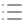

  <picture>
    <source media="(max-width: 767px)" srcset="assets/welcome-banner-mobile.svg">
    
  </picture>

##  About Me

My goal is to bridge **AI research and real-world applications** through data-driven problem solving.

<table>
<tbody>
<tr>
<td colspan="2" width="6000" valign="top">
<h3> Profile</h3>

• <strong>Hanbat National University</strong> &emsp;Computer Engineering · 2nd-year Undergraduate  

</td>
<td rowspan="2" width="4000" valign="top">
<h3> Current Focus</h3>

&emsp;<strong>Industrial Time-Series Anomaly Detection</strong>

&emsp;Reinforcement Learning

&emsp;Selective Reference Updates

&emsp;AI-based Stage Control

</td>
</tr>
<tr>
<td width="3500" valign="middle">

• <strong>EcoAI Lab</strong> &emsp;Undergraduate Researcher

</td>
<td width="2500" align="center" valign="middle">

 

<a href="https://sites.google.com/view/ecoai/introduction">Lab Website</a>
</td>
</tr>
</tbody>
</table>

### Research Interests

<code>Artificial&nbsp;Intelligence</code> · <code>Reinforcement&nbsp;Learning</code> · <code>Time-Series&nbsp;Analysis</code> · <code>Physical&nbsp;AI</code> · <code>Autonomous&nbsp;Driving</code>

 

##  Tech Stack

### Languages

  
  
  

### AI &amp; Data Science

  
  
  
  

 

##  Research Timeline

### 2026

- `11.19 – 11.20` **한국통신학회 추계종합학술발표회(예정)**  
  강원도 홍천 소노캄 비발디파크

  > Q-learning 기반 선택적 정상 기준선 갱신을 통한 금속 산업 전력 이상탐지

 

##  Experience & Activities

### 2026

- `09.04 – 09.06` **국제로봇올림피아드(IRO) 운영요원**  
  KAIST

  > 참가자 안내, 경기 진행 보조 및 현장 운영 지원

- `08.31` **공공데이터 활용 공모전**  
  국립한밭대학교

  > 대덕특구 공공기술의 사업화를 위한 기술 탐색 및 청년 창업 아이디어 추천 플랫폼 기획

 

##  Activity Overview

### 2026

<table>
<thead>
<tr>
<th width="1200"><small>기간</small></th>
<th width="2900"><small>활동</small></th>
<th width="3600"><small>내용</small></th>
<th width="2300"><small>장소</small></th>
</tr>
</thead>
<tbody>
<tr>
<td><small>11.19–11.20</small></td>
<td><small>한국통신학회 추계종합학술발표회(예정)</small></td>
<td><small>Q-learning 기반 금속 산업 전력 이상탐지 연구</small></td>
<td><small>강원도 홍천 소노캄 비발디파크</small></td>
</tr>
<tr>
<td><small>09.04–09.06</small></td>
<td><small>국제로봇올림피아드(IRO) 운영요원</small></td>
<td><small>참가자 안내·경기 진행 보조·현장 운영 지원</small></td>
<td><small>KAIST</small></td>
</tr>
<tr>
<td><small>08.31</small></td>
<td><small>공공데이터 활용 공모전</small></td>
<td><small>공공기술 탐색·청년 창업 아이디어 추천 플랫폼 기획</small></td>
<td><small>국립한밭대학교</small></td>
</tr>
</tbody>
</table>

 

##  Contact

  Email · <a href="mailto:20251779@edu.hanbat.ac.kr">20251779@edu.hanbat.ac.kr</a>

